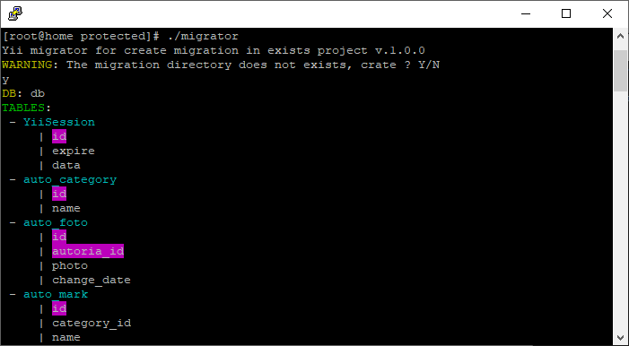
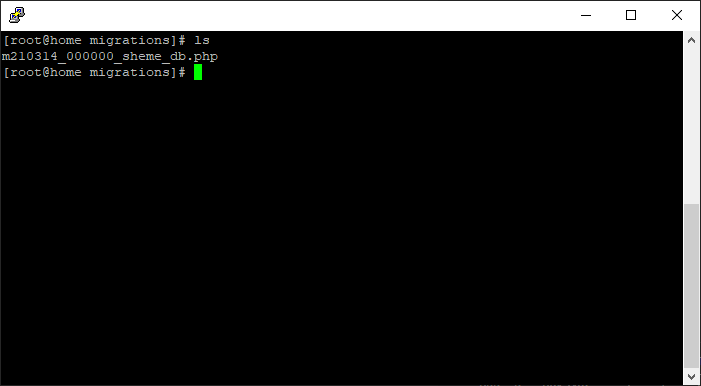
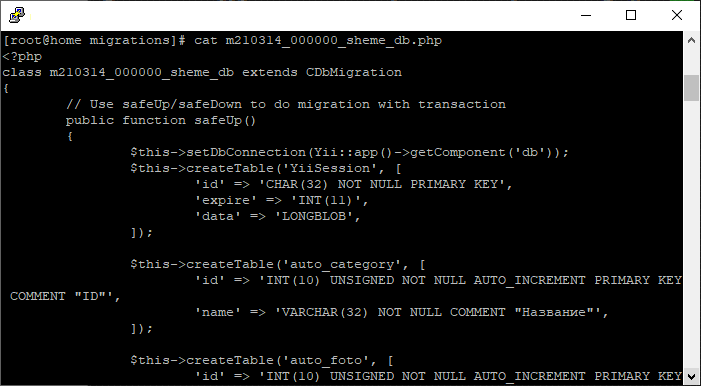

# Yii_migrator
Creating automatic migrations in existing projects.
The script reads all components from the main config with ".db" specified in the class and then opens the database schema, reads all tables and creates migrations for these tables. indexes are also created, if any. 

### What's included
```
Yii_migrator
  ├── migrator
  ├── migrator.bat
  └── migrator.php
```
### Screenshots
 
 

### Instruction
Copy the files to the project folder "*protected*" and, depending on your OS, run migrator or migrator.bat

After starting, a directory with migrations and migration files with existing databases and all tables in them will be created. 

Attention ! If the script caused you an error, try to edit the file *migrator.php* and specify the correct path to the FRAMEWORK folder 
```
# change here if your framework in other path
$yii = $current_dir . '/../../framework/yii.php';
```

**Social Media:**

Twitter: <http://www.twitter.com/jdayamx>

Facebook: <http://www.facebook.com/jdayamx>