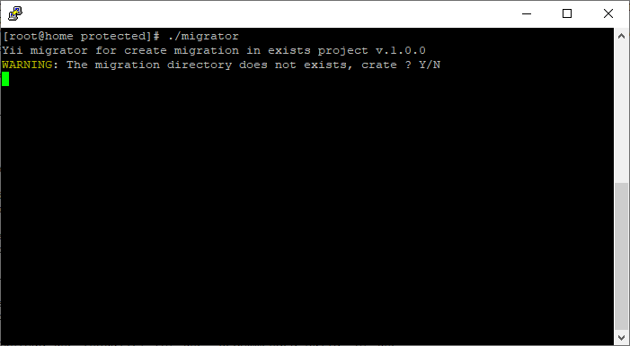

# Yii_migrator
Creating automatic migrations in existing projects

### What's included
```
Yii_migrator
  ├── migrator
  ├── migrator.bat
  └── migrator.php
```
### Screenshots


### Instruction
Copy the files to the project folder "*protected*" and, depending on your OS, run migrator or migrator.bat

After starting, a directory with migrations and migration files with existing databases and all tables in them will be created. 

**Social Media:**

Twitter: <http://www.twitter.com/jdayamx>

Facebook: <http://www.facebook.com/jdayamx>